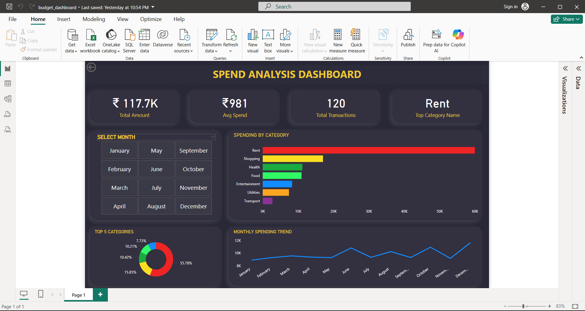
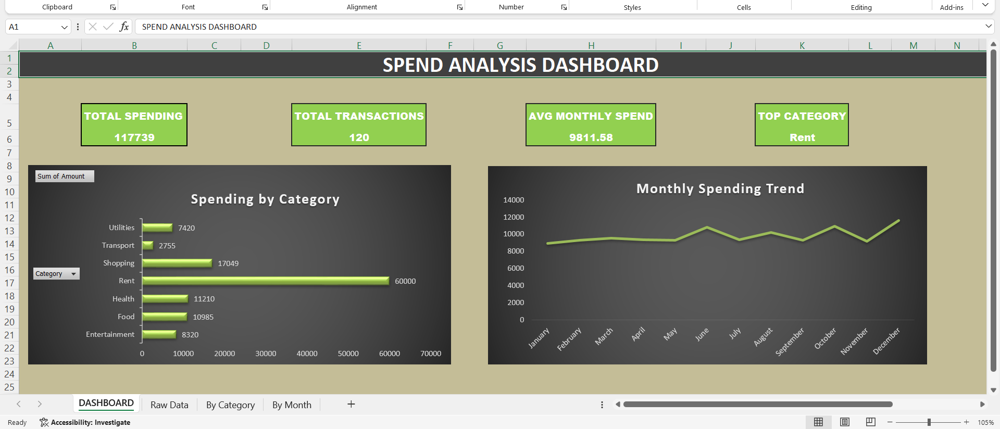

# Personal-Budget-Analysis-Dashboard - Data Analytics Project

Analyzed personal expense data to track spending patterns, identify high-expense categories, and build interactive dashboards for financial insights and better financial decision-making.

## Tools Used

- **Python** — generated sample dataset, cleaned and analyzed data
- **Excel** — pivot tables, bar chart and monthly trend line chart  
- **Power BI** — interactive dashboard with KPI cards and slicers

## About the Dataset

Simulated personal expense dataset created to reflect real-world spending patterns.  
Designed for analysis and dashboard development
It contains 120 expense transactions across 12 months with 7 categories:

- Rent
- Food
- Transport
- Health
- Shopping
- Entertainment
- Utilities

## Project Workflow
```
Create dataset (Python)
        ↓
Clean and analyze data (Python + pandas)
        ↓
Export to Excel (Python)
        ↓
Pivot tables and charts (Excel)
        ↓
Interactive dashboard (Power BI)
```
## Key Insights

- 120 transactions across 12 months
- Total annual spending: Rs 1,17,729
- Highest spending category: Rent
- Average monthly spend: Rs 9,811

## Files

expenses.py  Generates the sample dataset 
analyze.py  Analyzes data and exports to Excel
expense.csv Generated sample data
budgetsummary.xlsx Excel pivot table and charts
powerbi_ss.png Power BI dashboard screenshot
excel_screenshot.png Excel dashboard screenshot

## Screenshots

### Power BI Dashboard


### Excel Dashboard


## What I Learned

- Reading and analyzing data using pandas in Python
- Creating pivot tables and charts in Excel
- Building interactive dashboards in Power BI
- Connecting tools together in a real workflow
- Uploading a project to GitHub
